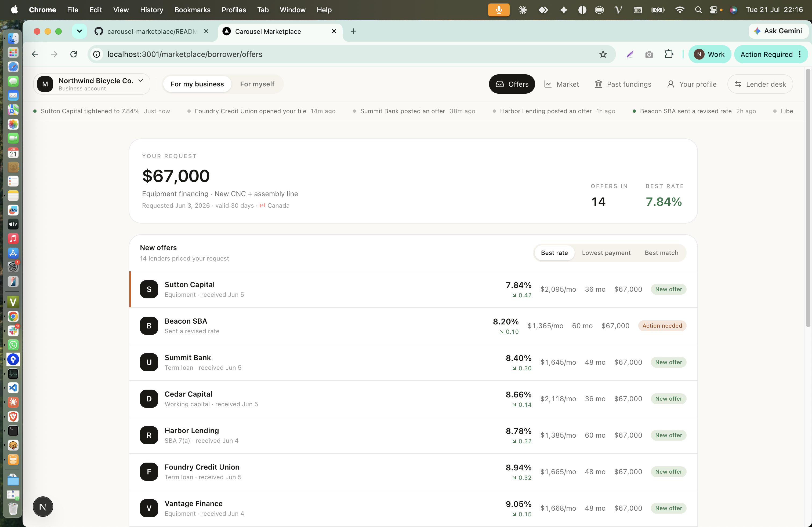
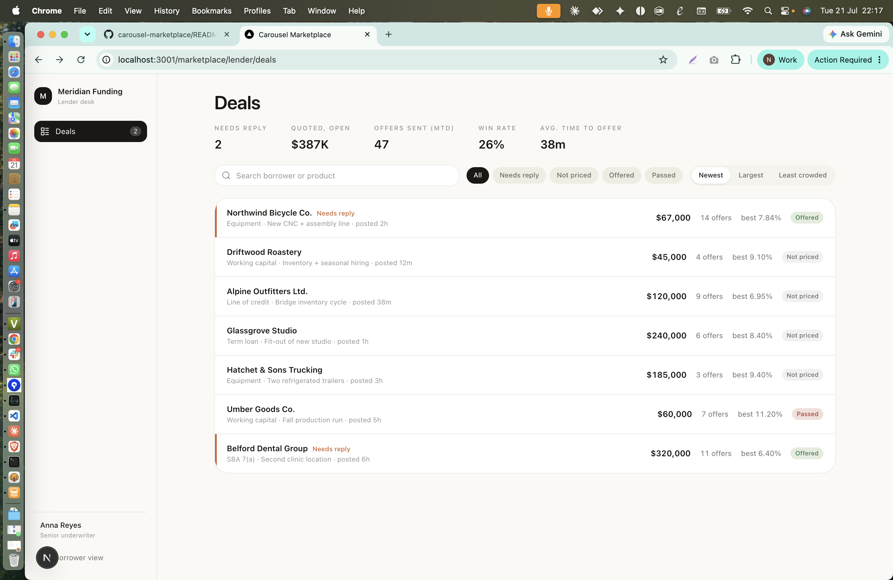
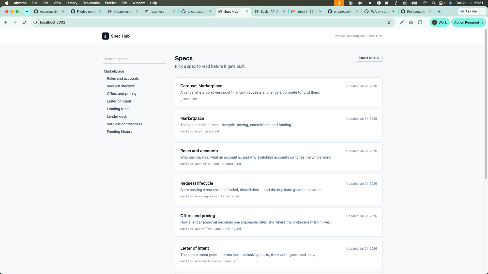
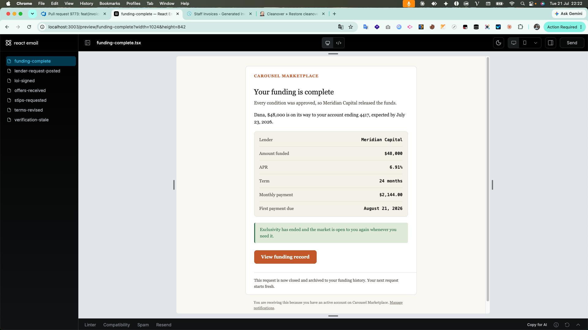

# Carousel Marketplace

A two-sided lending marketplace: borrowers post financing requests, lenders
compete to fund them. Monorepo managed with Turborepo and pnpm.

## The two sides

One domain model, two lenses. Both screens read the same request — they differ
in what that request means to the person looking at it.

**Borrower — offers.** The ranked list, best rate first. Fourteen lenders priced
a $67,000 equipment request; the borrower compares rate, payment and term, and
signs exactly one.



**Lender — deals.** The same requests as a work queue: what needs a reply, what
is still unpriced, how crowded each deal already is. `best 7.84%` on the
Northwind row is the number the borrower screen above is showing.



## Spec-first

The behaviour above is written down before it is built. [`apps/specs`](apps/specs)
serves `specs/**/*.md` as a browsable hub — nav tree from the folder structure,
client-side search, and a dependency graph declared per spec via `depends_on`.



**Export corpus** renders the whole tree as one markdown document, which is the
"hand the entire spec set to an AI" primitive. No backend: the markdown is
inlined at build time.

## Transactional email

[`packages/email`](packages/email) holds one template per point in the lifecycle
where someone has to be told something — offers in, LOI signed, conditions
requested, terms revised, funded, verifications stale, and a new request for the
lender desk. React Email's dev server previews each with realistic props.



The package renders and does not send: `renderEmail(name, props)` returns
`{subject, html, text}` and stops there, so editing a template never puts you
near sending credentials.

## Stack

| Layer    | Technology                                                      |
| -------- | --------------------------------------------------------------- |
| API      | NestJS · GraphQL · Prisma · PostgreSQL · Redis · BullMQ         |
| Frontend | Next.js 16 (App Router, Turbopack) · TypeScript · Redux Toolkit |
| Auth     | Auth0 (PKCE) · JWT (RSA) · Email/Password                       |
| Monorepo | Turborepo · pnpm workspaces                                     |
| UI       | shadcn/ui · Tailwind CSS v4                                     |
| Email    | React Email                                                     |

## Structure

```
.
├── apps
│   ├── api          # NestJS GraphQL API (port 7001)
│   ├── frontend     # Next.js app — admin + marketplace (port 3000)
│   ├── specs        # Spec hub, React + Vite, markdown-only (port 3002)
│   └── storybook    # Workbench for @repo/ui (port 3004)
└── packages
    ├── @repo/core   # Shared enums, constants, utilities
    ├── @repo/ui     # Shared React components (shadcn/ui) + design tokens
    ├── @repo/email  # Transactional email templates (React Email, preview 3003)
    ├── @repo/eslint-config
    ├── @repo/jest-config
    └── @repo/typescript-config
```

Each app and package has its own README covering what it does and the
decisions behind it.

The design tokens live in `packages/ui/src/styles/tokens.css` and are imported
by both `apps/frontend` and `apps/storybook` — one palette, two consumers. See
[apps/storybook/README.md](apps/storybook/README.md) for the Tailwind v4
details that matter when adding a third.

## Prerequisites

- Node.js >= 24 (see `.nvmrc` — v24.18.0)
- pnpm >= 8.15.5
- PostgreSQL
- Redis

## Setup

```bash
# Install dependencies
pnpm install

# Configure environment
cp apps/api/.env.example apps/api/.env
cp apps/frontend/.env.example apps/frontend/.env.local
# Edit all .env files with your values
```

## Development

```bash
# Run all apps
pnpm dev

# Run individually
pnpm --filter api dev            # :7001
pnpm --filter frontend dev       # :3000
pnpm --filter @repo/specs dev    # :3002  spec hub
pnpm --filter @repo/email dev    # :3003  email template preview
pnpm --filter storybook dev      # :3004  component workbench

# Sync GraphQL schema + regenerate types
pnpm --filter frontend sync-schema
pnpm --filter frontend codegen
```

## Build

```bash
# Build all
pnpm build

# Build shared packages first (required for individual app builds)
pnpm build:packages
pnpm --filter api build
pnpm --filter frontend build
```

## Testing

```bash
pnpm test          # Unit tests (all)
pnpm test:e2e      # E2E tests (all)

pnpm --filter api test
pnpm --filter @repo/email test   # renders every template
pnpm --filter frontend check-types
```

## Lint & Format

```bash
pnpm lint          # Lint all packages
pnpm format        # Prettier format
```

## Environment Variables

### `apps/api/.env`

| Variable                    | Description                               |
| --------------------------- | ----------------------------------------- |
| `DATABASE_URL`              | PostgreSQL connection string              |
| `REDIS_HOST` / `REDIS_PORT` | Redis connection                          |
| `JWT_PRIVATE_KEY`           | RSA private key (base64)                  |
| `JWT_PUBLIC_KEY`            | RSA public key (base64)                   |
| `AUTH0_DOMAIN`              | Auth0 tenant domain                       |
| `AUTH0_AUDIENCE`            | Auth0 API audience                        |
| `AUTH0_M2M_CLIENT_ID`       | Auth0 M2M client ID                       |
| `AUTH0_M2M_CLIENT_SECRET`   | Auth0 M2M client secret                   |
| `PORT`                      | API port (default: 7001)                  |
| `SEED_ON_START`             | `true` to seed demo accounts on app start |
| `BYPASS_AUTH`               | `true` to skip auth checks (dev only)     |

### `apps/frontend/.env.local`

| Variable                      | Description                        |
| ----------------------------- | ---------------------------------- |
| `NEXT_PUBLIC_API_ENDPOINT`    | API host (e.g. `localhost:7001`)   |
| `NEXT_PUBLIC_USE_SSL`         | `true` / `false` (default: `true`) |
| `NEXT_PUBLIC_AUTH0_DOMAIN`    | Auth0 tenant domain                |
| `NEXT_PUBLIC_AUTH0_CLIENT_ID` | Auth0 SPA client ID                |
| `NEXT_PUBLIC_AUTH0_AUDIENCE`  | Auth0 API audience                 |

## Auth Flow

Two sign-in methods:

1. **Email/Password** — `signIn` GraphQL mutation → validates credentials → returns JWT
2. **Auth0** — Auth0 Universal Login → redirect to `/callback` → `signInByAuth0` mutation → returns JWT

JWT stored in `localStorage` + `session_token` cookie for middleware auth.

## Demo Accounts

Set `SEED_ON_START=true` in API `.env` — seeds on app startup (upserts, so it is
safe to run repeatedly).

One account per role, matching the three the app actually has:

| Email                               | Password                | Privileges              | Lands on                     |
| ----------------------------------- | ----------------------- | ----------------------- | ---------------------------- |
| `admin@carousel-marketplace.dev`    | `Admin@2026!Secure`     | `SUPER_ADMIN` + `ADMIN` | `/admin/dashboard`           |
| `lender@carousel-marketplace.dev`   | `Lender@2026!Secure`    | `LENDER`                | `/marketplace/lender/deals`  |
| `borrower@carousel-marketplace.dev` | `Borrower@2026!Secure`  | `BORROWER`              | `/marketplace/borrower/offers` |

Each gets the matching access policy — Super Admin + Admin, Lender, or Borrower
— assigned by privilege. The landing route is decided in one place, `homeFor()`
in `apps/frontend/proxy.ts`.

Local dev only. These are seeded credentials in source control, so
`SEED_ON_START` must never be `true` outside a local environment.

> The seed list is `SEED_USERS` in
> `apps/api/src/modules/@core/seed/seed.service.ts` — update it there first, then
> this table.
